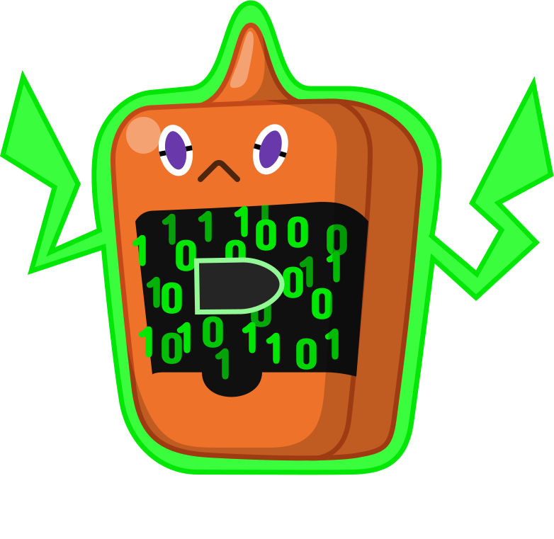

# BulletBot

This is a general-purpose Discord bot that originated from a webhook problem in the [Code Bullet and Co](https://discord.gg/3wTEZkh) server. During the prelaunch development time, the main creator [Codec](https://github.com/Jet132) decided to extend this project to replacing every bot in the server. Until now, I only replaced one entire bot but also some functions from other bots.

## Our Discord server

As this is Discord bot all contributors are on Discord. We have a server only for the bot, which you can join here:

## Getting Started

There are two types of guides in the [wiki](https://github.com/CodeBullet-Community/BulletBot/wiki). One is for actually running the bot on a server 24/7 and the other one is for setting up a development environment for your self.

- Server Setup (Running 24/7):
  - [Linux](https://github.com/CodeBullet-Community/BulletBot/wiki/Linux-Server-Setup-Guide)
  - No Windows guide (You can add one if you like)
- Development Setup:
  - [Windows](https://github.com/CodeBullet-Community/BulletBot/wiki/Windows-Dev-Setup-Guide)
  - [Linux](https://github.com/CodeBullet-Community/BulletBot/wiki/Linux-Dev-Setup-Guide)

If you need help you can ask on the Discord server.

## Built With

- [Node.js](https://nodejs.org) - the JS Engine this bot runs on
- [MongoDB](https://www.mongodb.com) - NoSQL database used for storing bot data (duhhh)
- [TypeScript](https://www.typescriptlang.org/) - Language the bot is written in (typed superset of JavaScript)
- [Discord.js](https://discord.js.org) - Node.js module used as interface for the Discord API

## Contributing

Please read [CONTRIBUTING.md](CONTRIBUTING.md) for details on the process for submitting pull requests to us.

## Versioning

We use [SemVer](http://semver.org/) for versioning. For the versions available, see the [tags on this repository](https://github.com/CodeBullet-Community/BulletBot/tags).

## License

This project is licensed under the GNU AGPLv3 License - see the [LICENSE](LICENSE) file for details

## Logo/PFP

The original logo/PFP was a fanart from @Aster#4205 and was later vectorized by [Codec](https://github.com/Jet132/).

Original:

Vectorized:

