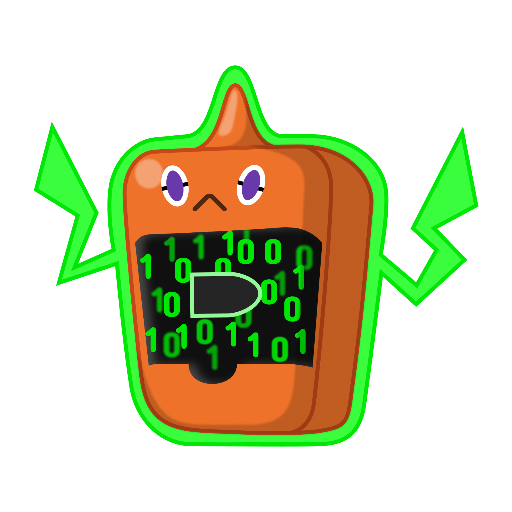

# BulletBot

This is a bot for the [Code Bullet and Co](https://discord.gg/7Z5d4HF) discord server. It was originally made to fix a webhook role mentioning problem, but the goal was extended to replacing all bots in the server. (Which it currently can't)

## Coding style

When planning a feature, keep in mind, that the bot should be stateless. AKA all data should be stored in the database, so the bot can crash or shutdown at any time and resume it's work later like before.

### General guide

As a style guide we use [this](https://github.com/basarat/typescript-book/blob/master/docs/styleguide/styleguide.md) guide from basarat and his typescript book.

### Arguments in Utils and Database

All arguments in utils functions and database functions (so all functions defined in `/utils` and `/database`) should have their arguments ordered in a following way:

 1. guild / guildID
 2. user / userID
 3. member / memberID
 4. role / roleID
 5. channel / channelID
 6. message / messageID
 7. others

## Build Docs

install typedoc with `npm install --global typedoc` and then run 
```
typedoc --out [path to output folder] .\src\ --tsconfig .\tsconfig.json --mode file --name BulletBot --readme .\README.md --media .\media\
```

## How to run the bot

Codec is using Typescript 3.4.1 but any version will probably work if you use the `tsconfig.json`. The bot also needs a `bot-config.json` file in `src\` and respectively `out/`. The json structure is the following:

```JSON
{
    "version": "v1.0", //the version of the current build
    "botToken": "[bot token here]",
    "cluster": {
        "url": "mongodb://localhost", // url to mongo cluster
        "suffix": "?authSource=admin" // string that comes after the full url (for example for auth)
    },
    "googleAPIKey": "[google api key for youtube_v3]",
    "bugForm": { // google form for suggestions
        "url": "https://docs.google.com/forms/d/e/1FAIpQLScWsqLDncKzqSgmZuFhuwenqexzmKSr0K_B4GSOgoF6fEBcMA/formResponse",
        "serverID": 668269162,
        "serverName": 1681307100,
        "userID": 939179046,
        "userName": 1772634886,
        "messageID": 2084912430,
        "channelID": 1743035358,
        "bug": 110649897
    },
    "suggestionForm": { // google form for suggestions
        "url": "https://docs.google.com/forms/d/e/1FAIpQLSee3V4--MxBJqPjoDgfUIw2u22NG-4GBlT92Bbj10-R1ScuHA/formResponse",
        "serverID": 668269162,
        "serverName": 1681307100,
        "userID": 939179046,
        "userName": 1772634886,
        "messageID": 2084912430,
        "channelID": 1743035358,
        "suggestion": 110649897
    },
    "globalUpdateInterval": 10000,
    "cleanInterval": 60000,
    "pActionsInterval": 1000,
    "crashProof": {
        "file": "../crashProof.time", // the bot will write the current timestamp to this file
        "interval": 10000
    },
    "callback": {
        "URL": "[callback ip address for webhook]",
        "port": 8080, // port in callback ip
        "path": "/webhooks", // results in http://[ip]:[port]/webhooks/[service]
    },
    "youtube": {
        "logo": "https://www.android-user.de/wp-content/uploads/2018/07/icon-youtobe.png",
        "color": 16711680,
        "name": "YouTube"
    }
}
```

There also needs to be a mongoDB cluster running. The minimal data in the cluster is in database `settings` in collection `settings` there should be a document with following data.

```JSON
{
   "prefix":"?!",
   "presence":{
      "status":"online",
      "game":{
         "name":"something",
         "type":"WATCHING"
      }
   },
   "embedColors":{
      "default":8311585,
      "help":8311585,
      "neutral":4868682,
      "negative":15805477,
      "warn":16086051,
      "positive":8311585
   },
   "botMasters":[
      "[a bot masters user id]"
   ],
   "commands":{
      "animal":{
         "apis":{
            "cat":"https://some-random-api.ml/img/cat",
            "dog":"https://some-random-api.ml/img/dog",
            "fox":"https://some-random-api.ml/img/fox",
            "panda":"https://some-random-api.ml/img/panda",
            "red-panda":"https://some-random-api.ml/img/red_panda",
            "bird":"https://some-random-api.ml/img/birb",
            "pikachu":"https://some-random-api.ml/pikachuimg"
         }
      },
      "purge":{
         "maxMessages": 1000
      }
   },
   "filters":{

   }
}
```

## Logo/PFP

The original logo/PFP was a fanart from @Aster#4205.

Original:


Vectorised:

