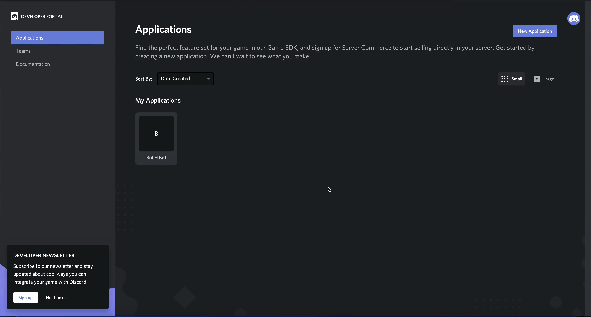

# Finding and Coping a Bot Token

This guide will walk you through the steps to find and copy the bot token for an existing Discord application.

If you currently don't have an already existing application, you will need to [create one](../Creating-&-Inviting-A-Bot#creating-a-discord-application).

- Navigate to the [discord developer portal](https://discordapp.com/developers/applications/) and log into your Discord account.
- Open your existing application.
- Click on the "Bot" tab in the settings category on the left of your screen.
- Click "Copy" to copy the Bot Token.
