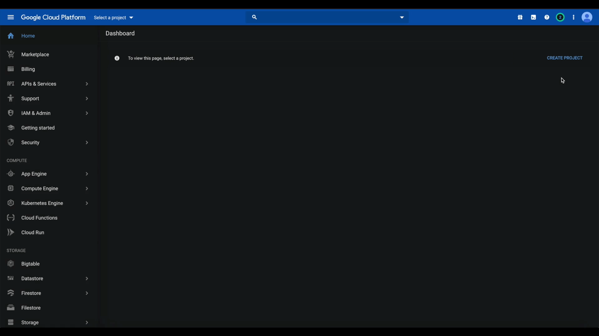

# Creating and Coping a Google API Key

Here we'll be looking at how you can get a Google API Key for the bot so that you can use webhooks. BulletBot doesn't need the API to have working YouTube webhooks, but it uses it to resolve a channel or user name to a channel ID.

- Go to the Google API Console: <https://console.cloud.google.com/projectselector2/home/dashboard>
- Create a new project by pressing the "Create Project" button at the top right of your window.
- Give your project a name.
- Click on the "Marketplace" tab in the drop-down menu on the left of your screen.
- Search `youtube data api v3` and select the first result.
- Enable the API.
- Navigate to the project credentials page at <https://console.cloud.google.com/apis/credentials>. (Check that you have still the right project chosen because this link doesn't specify that)
- Select `API Key` in the `Create Credentials` drop-down.
- Copy the API, and you are now set.

!!! important
    Do NOT share the API key with others. Everyone that has the key can freely use your API quota.
