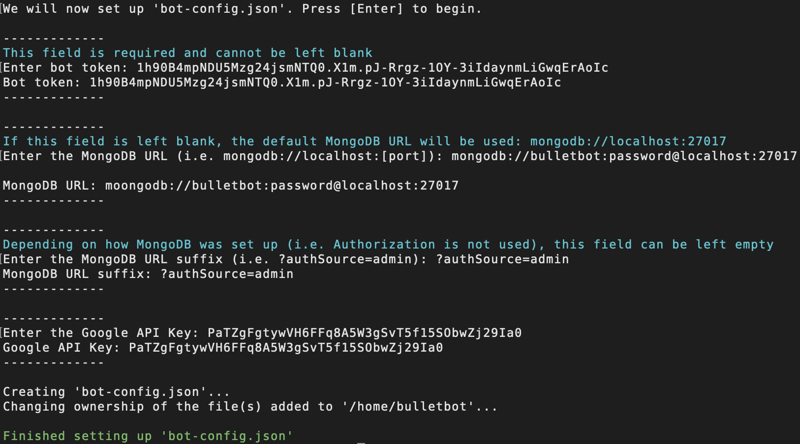
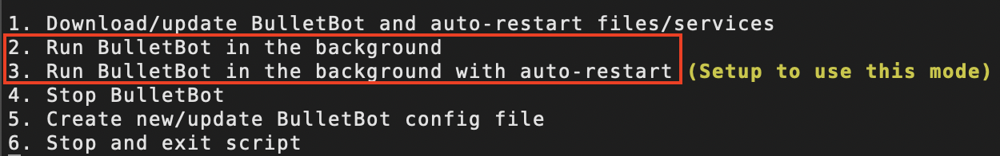
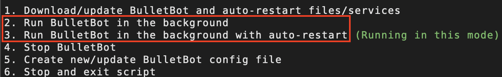
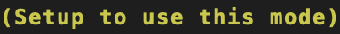
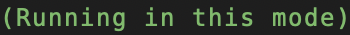

# Linux Production Setup Guide

This setup guide will instruct and explain the process in which BulletBot is set up on a Linux based distribution. The majority of the setup is taken care of by the installers, which will automate the installation and set up of the prerequisites. That said, there is a small portion of this guide that requires manual set up.

If you are doing dev work on BulletBot or just want to set him up manually, please follow the [Linux Dev Setup Guide](../../../Setup-Guides/Development/Linux-Dev-Setup-Guide/).

## Officially Supported Linux Distributions

Below is a list of Linux Distributions that BulletBot is officially supported on. It also lists what versions of MongoDB and Node.js, along with other system specifications that are supported on specific distributions:

| Distro        | MongoDB Support        | Node\.js Support | Architecture |
|---------------|------------------------|------------------|--------------|
| Ubuntu 16\.04 | 3\.4, 3\.6, 4\.0, 4\.2 | 8\.x\-13\.x      | 64 bit<br>- \(ARM64 not supported\) |
| Ubuntu 18\.04 | 4\.0, 4\.2             | 8\.x\-13\.x      | 64 bit       |
| Debian 9      | 4\.0, 4\.2             | 8\.x\-13\.x      | 64 bit       |
| Debian 10     | 4\.2\.1\+              | 8\.x\-13\.x      | 64 bit       |
| RHEL 7        | 3\.4, 3\.6, 4\.0, 4\.2 | 8\.x\-13\.x      | 64 bit       |
| RHEL 8        | 4\.2\.1\+              | 8\.x\-13\.x      | 64 bit       |
| CentOS 7      | 3\.4, 3\.6, 4\.0, 4\.2 | 8\.x\-13\.x      | 64 bit       |
| CentOS 8      | 4\.2\.1\+              | 8\.x\-13\.x      | 64 bit       |

For more information on supported platforms specific to MongoDB and Node.js, visit:

* MongoDB: <https://docs.mongodb.com/manual/installation/#supported-platforms>
* Node.js: <https://github.com/nodesource/distributions/blob/master/README.md>

### Versions of MongoDB and Node.js Installed

These are the versions of MongoDB and Node.js that are installed via the installers:

* MongoDB: Version 4.2.x
* Node.js: Version 13.x

!!! note
    If you instead install older versions of the two pieces of software, refer to the table above for compatible versions of each software that corresponds to their respective Linux Distributions.

## Getting Started

To start the setup process, first download the master installer: `cd ~/ && wget -N https://github.com/CodeBullet-Community/BulletBot/releases/latest/download/linux-master-installer.sh && sudo chmod +x linux-master-installer.sh`

Execute the master installer using `sudo bash linux-master-installer.sh`, then download BulletBot via option `1` in the installer menu.

??? info "Downloading from a specific release"
    If you rather download a specific release (such as a pre-release), download the corresponding master installer via: `cd ~/ && wget -N https://github.com/CodeBullet-Community/BulletBot/releases/download/[tag]/linux-master-installer.sh && sudo chmod +x linux-master-installer.sh`

    * Replace `[tag]` with the tag/version number of the release you want to download the master installer from.
    * Please note that if you use this method, you might not get the results that you are expecting, since the master and sub-master installers will usually grab files from the most recent release. Pre-releases, on the other hand, will only grab items from the release it was in.

### Running the Master Installer for the First Time

When running the master installer for the first time, a system user called `bulletbot` will be created (see [the In-Depth Explanations wiki](../../../In-Depth-Explanations/#bulletbot-system-user) for more info). All code used by/for BulletBot will then be moved into `/home/bulletbot`.


## Setting Up and Installing Prerequisites

The installers automatically detect whether or not the prerequisites have been installed or set up. If it detects that some or all have not been installed/set up, you'll be prompt a menu that looks similar to the one below:


The menu will indicate whether or not a particular prerequisite is installed/set up. To install a missing prerequisite, enter the number corresponding to that option.

Below, you will find information on what each option (excluding options 1 and 6) does and any additional or essential information associated with the option in question.

### 2. Install MongoDB

Option 2 installs, enables, and start MongoDB.

It is important to know that it does **NOT** set up the [MongoDB settings document](#adding-the-mongodb-settings-document). The settings document can be added to the database after all the other prerequisites have been installed/set up but must be taken care of before running BulletBot.

### 3. Install Node.js (will also perform the actions of option 4)

Option 3 installs Node.js, node, and npm.

As you might have read in the description of this option, it will also install the required packages and dependencies that would otherwise be installed via option 4.

### 4. Install required packages and dependencies

Option 4 installs the required packages and dependencies in a folder called `node_modules` in `/home/bulletbot`.

Because option 3 already takes care of this, it is unlikely that you'll need to use this option, but is provided as a failsafe, just in case something happens to the packages and dependencies.

### 5. Set up BulletBot config file

Option 5 requires you to enter information such as the bot key, MongoDB URL, and so on. This information will be placed into BulletBot's configuration file (`bot-config.json`).

First and foremost, if you haven't already [created an application/bot](../../../Helpful-Guides/Creating-%26-Inviting-A-Bot/#creating-and-inviting-a-discord-application), do so now. You'll need the bot key that is generated when setting up BulletBot's config file. Once you have done this, you can continue and set up the config file.

#### 5.1. Setting Up bot-config.json WITHOUT MongoDB Authentication

If you prefer to set BulletBot up WITHOUT MongoDB Authentication (which is not recommended), configurations for the config file are rather straight forward.

1. `Enter bot token:`
    * The bot token should look similar to: `1h90B4mpNDU5Mzg24jsmNTQ0.X1m.pJ-Rrgz-1OY-3iIdaynmLiGwqErAoIc`.
    * For help on finding and coping the bot token for your application, follow [this guide](../../../Helpful-Guides/Bot-Token).
2. `Enter the MongoDB URL (i.e. mongodb://localhost:[port]):`
    * If you don't plan on doing anything fancy with MongoDB (i.e., replication, etc.), you can leave this field blank, and the default MongoDB URL (`mongodb://localhost:27017`) will automatically be used.
    * Though if you plan to do some advanced things with MongoDB, use [this link](https://docs.mongodb.com/manual/reference/connection-string/) to help you properly configure the URL.
3. `Enter the MongoDB URL suffix (i.e. ?authSource=admin):`
    * Similar to field 2, unless you are doing some fancy stuff with MongoDB, you can leave this field blank.
4. `Enter the Google API Key:`
    * The Google API Key should look similar to: `PaTZgFgtywVH6FFq8A5W3gSvT5f15SObwZj29Ia0`
    * For help on creating a Google API Key, follow the instructions in [this guide](../../../Helpful-Guides/Google-API-Setup).
    * Note that if you leave this field empty, you will not be able to use any services and commands that rely on Google services (i.e., webhooks).

Here is an example of what it might look like:


#### 5.2. Setting Up bot-config.json WITH MongoDB Authentication

If you want to use [authentication](#adding-authentication) in combination with MongoDB (which is highly recommended), the configurations for the config file will be a little different compared to if you were to use MongoDB without authentication.

??? info "Fields 1 and 4"
    Please refer [above](#51-setting-up-bot-configjson-without-mongodb-authentication) for information on fields 1 and 4, as they are the same no matter if authentication is enabled or disabled.

1. N/A
2. `Enter the MongoDB URL (i.e. mongodb://localhost:[port]):`
    * When using authentication, this field cannot be left empty. At the bare minimum, you must enter `mongodb://bulletbot:[bulletbot MongoDB password]@localhost:[port]`. More can be added to the URL, but what is shown is the bare minimum for what the suffix can be.
      * Replace `[bulletbot MongoDB password]` with a password that you'll be giving the bulletbot user when setting up [MongoDB Authentication](#adding-authentication).
      * Replace `[port]` with the port number that MongoDB/mongod.service will be using (default port is `27017`).
        * Please note that if you are using a firewall, you'll need to allow incoming traffic through the port that `mongod.service` will use.
    * If you plan on doing some advanced things with MongoDB, use [this link](https://docs.mongodb.com/manual/reference/connection-string/) to help you properly configure the URL.
3. `Enter the MongoDB URL suffix (i.e. ?authSource=admin):`
    * Similar to field 2, this field cannot be left empty. At the bare minimum, you must enter `?authSource=admin`. More can be added to the suffix, but what is shown is the bare minimum for what the suffix can be.
4. N/A

Here is an example of what it might look like:


#### 5.3 Webhooks

By default, webhooks run on port 8000. So if you have a firewall running, make sure that you open port 8000. Please note that if your public IP Address is not static, it will not be possible to use webhooks.

## Setting Up MongoDB

At this point, MongoDB should already be installed, enabled, and running. Below are instructions on how to change the default port MongoDB uses (optional), add the MongoDB settings document (required), and set up MongoDB Authentication (optional).

### Changing MongoDB's Default Port

MongoDB uses port `27017` by default. If you want to change what port MongoDB runs on, you will need to modify its config file.

Follow the instructions below to change the port MongoDB runs on:

1. Open `/etc/mongod.conf` with root privilege, using your favorite editor.
2. Navigate to the line containing something similar to `port: 27017`
3. Replace `27017` with the port number that you would like MongoDB to run on.
4. Save and exit the file.
5. Restart mongod.service: `sudo systemctl restart mongod`

### Adding the MongoDB Settings Document

BulletBot needs a settings document placed in the database to work. This document is similar to `bot-config.json`, but whereas the JSON file requires BulletBot to be a restart for any changes to be applied, changes to the settings document take immediate effect.

Before adding the document, make sure to add your Discord user ID to the `botMasters` field. The ID should be a long string of numbers similar to `516213540576277819`.

Follow the instructions below to add the settings document to the MongoDB database:

1. Open the mongo shell: `mongo --port [port]`
2. Switch to the `settings` collection: `use settings`
3. Insert the following document:

        :::json
        db.settings.insert(
        {
            "prefix": "?!",
            "presence": {
                "status":"online",
                "game": {
                    "name":"?!help",
                    "type":"Playing"
                }
            },
            "embedColors": {
                "default": 8311585,
                "help": 8311585,
                "neutral": 4868682,
                "negative": 15805477,
                "warn": 16086051,
                "positive": 8311585
            },
            "botMasters": ["[user ID of bot masters]"],
            "commands": {
                "animal": {
                    "apis": {
                        "cat": "https://some-random-api.ml/img/cat",
                        "dog": "https://some-random-api.ml/img/dog",
                        "fox": "https://some-random-api.ml/img/fox",
                        "panda": "https://some-random-api.ml/img/panda",
                        "red-panda": "https://some-random-api.ml/img/red_panda",
                        "bird": "https://some-random-api.ml/img/birb",
                        "pikachu": "https://some-random-api.ml/pikachuimg"
                    }
                },
                "purge": {
                    "maxMessages": 1000
                }
            }
        }
        )

    * Something similar to `WriteResult({ "nInserted" : 1 })` will be printed to the screen if the settings were successfully added to the database.

4. Exit the mongo shell: `exit`

### Adding Authentication

Enabling authentication causes MongoDB to require all users who connect to the database to authenticate/login to an existing user in the database. It is highly recommended that you enable this feature so that the cluster is secure and so that you can remotely access it, for example, with [MongoDB Compass](https://www.mongodb.com/products/compass).

!!! info
    For instructions on how to use/setup MongoDB Compass, follow [this guide](../../../Helpful-Guides/MongoDB-Compass/).

Follow the instructions below to enable authentication. Make sure to replace `[admin password]` with a password you'll remember, and `[bulletbot password]` with the password you used when setting up BulletBot's config file.

1. Open mongo shell: `mongo --port [port]`
2. Switch to the `admin` database, which stores all users: `use admin`
3. Create an admin user:

        :::json
        db.createUser(
        {
            user: "admin",
            pwd: "[admin password]",
            roles: [
                {
                    "role" : "userAdminAnyDatabase",
                    "db" : "admin"
                },
                {
                    "role" : "readWriteAnyDatabase",
                    "db" : "admin"
                },
                {
                    "role" : "clusterAdmin",
                    "db" : "admin"
                }
            ]
        }
        )

4. Create a user for BulletBot:

        :::json
        db.createUser(
        {
            user: "bulletbot",
            pwd: "[bulletbot password]",
            roles: [
                {
                    "role" : "readWrite",
                    "db" : "main"
                },
                {
                    "role" : "readWrite",
                    "db" : "webhooks"
                },
                {
                    "role" : "readWrite",
                    "db" : "mStats"
                },
                {
                    "role" : "read",
                    "db" : "settings"
                }
            ]
        }
        )

5. Check if both users were added with `db.getUsers()`. The output should look like this:
        
        :::json
        [
                {
                    "_id" : "admin.admin",
                    "userId" : UUID("[some id]"),
                    "user" : "admin",
                    "db" : "admin",
                    "roles" : [
                            {
                                "role" : "userAdminAnyDatabase",
                                "db" : "admin"
                            },
                            {
                                "role" : "readWriteAnyDatabase",
                                "db" : "admin"
                            },
                            {
                                "role" : "clusterAdmin",
                                "db" : "admin"
                            }
                    ],
                    "mechanisms" : [
                            "SCRAM-SHA-1",
                            "SCRAM-SHA-256"
                    ]
                },
                {
                    "_id" : "admin.bulletbot",
                    "userId" : UUID("[some id]"),
                    "user" : "bulletbot",
                    "db" : "admin",
                    "roles" : [
                            {
                                "role" : "readWrite",
                                "db" : "main"
                            },
                            {
                                "role" : "readWrite",
                                "db" : "webhooks"
                            },
                            {
                                "role" : "readWrite",
                                "db" : "mStats"
                            },
                            {
                                "role" : "read",
                                "db" : "settings"
                            }
                    ],
                    "mechanisms" : [
                            "SCRAM-SHA-1",
                            "SCRAM-SHA-256"
                    ]
                }
        ]

6. Exit the mongo shell: `exit`
7. If you have the cluster running with [replication](https://docs.mongodb.com/manual/replication/) enabled, you will have to add a key file. To do this, do the following:

        :::bash
        openssl rand -base64 756 > [path to key file]
        chmod 400 [path to key file]
        chown mongodb:root [path to key file]

    It's recommended that the key file is placed in the same directory as the `mongod.conf` file (default at `/etc/mongod.conf`) and is named `mongod.key`. You will also have to copy the key file to the other servers and repeat the `chmod` and `chown` command.

8. Open `/etc/mongod.conf` with root privilege, using your favorite editor, and add the following:

        :::yaml
        security:
            authorization: "enabled"
            keyFile: "[path to key file]" ## (only add this line when replication is enabled)

    If there is already a `security` property, just append the `authorization` property to it or change it to enabled. If replication is enabled, you will have to change the same stuff in the other config files on the other servers.

9. Restart mongod.service: `sudo systemctl restart mongod`

!!! note
    In this guide, we only add the `admin` and `bulletbot` users. If you want, you can add other users to it, which shouldn't affect the bot.

## Running BulletBot




!!! info
    A more in-depth look at the run modes can be read in the [In-Depth Explanations](../../../In-Depth-Explanations/#running-bulletbot) wiki.

### Run Modes

BulletBot can be run in two different modes:

* Run BulletBot in the background
  * This mode runs BulletBot in the background of the system. If the system is rebooted, BulletBot will NOT be started on system reboot.
* Run BulletBot in the background with auto-restart
  * This mode runs BulletBot in the background of the system. Though unlike the first run mode, if the system is rebooted, BulletBot will automatically be started.
    * The startup process for this run mode, at minimum, takes 1 minute and 20 seconds from the system reboot.

### Checking BulletBot Run Status

When the installers display BulletBot's run modes, it will also indicate whether a specific run mode is "Setup to use" or is "Running" in that mode.

When it displays:

* 
    * `bullet-mongo-start.service` exists and is either enabled or disabled (which determines which mode BulletBot runs in), but BulletBot is not currently running.
* 
    * BulletBot is currently running in [run mode].
    * Note: Choosing the option/run mode that this is displayed on, will cause bulletbot to restart in that same run mode.

## Updating BulletBot

You can use the same option that starts BulletBot, to update him.

To update BulletBot, do the following:

1. Execute the master installer: `sudo bash /home/bulletbot/linux-master-installer.sh`
2. Choose option `1` in the installer menu.
3. Follow the instructions displayed on your screen.

```txt
1. Download/update BulletBot  <-- [This option updates BulletBot]
2. Run BulletBot in the background
3. Run BulletBot in the background with auto-restart (Running in this mode)
4. Stop BulletBot
5. Create new/update BulletBot config file
6. Stop and exit script
```

!!! info
    For a more in-depth look on how BulletBot is updated, can be read in the [In-Depth Explanations](../../../In-Depth-Explanations/#downloading-and-updating-bulletbot) wiki.

## Other Information

When BulletBot is running in the background with auto-restart, the installers can send a report via postfix/sendmail on BulletBot's startup status. The report lists whether or not BulletBot was successfully started, the exit status of essential services, and the startup logs of three services that can be used to help identify errors that might have occurred during BulletBot's startup. To learn how to set up this feature, follow [this guide](../../../Helpful-Guides/BulletBot-Startup-Status-Reports/).
